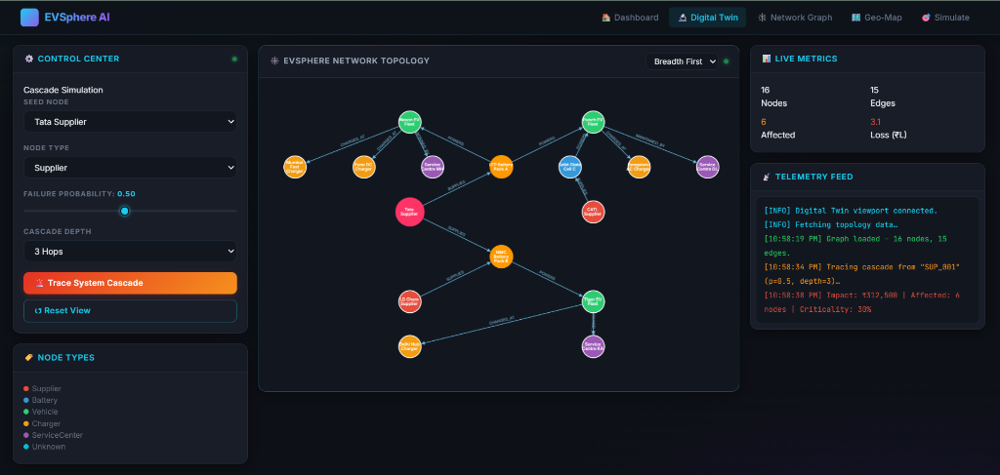
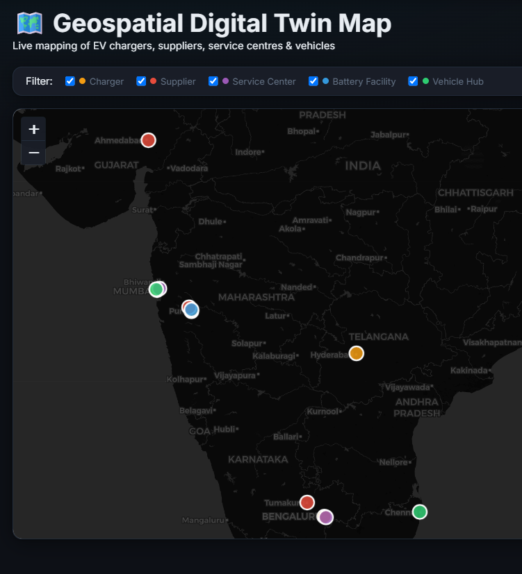
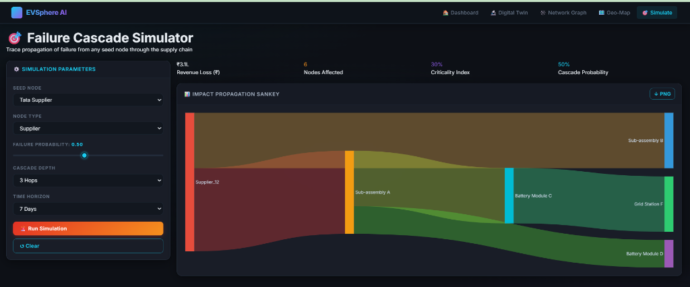
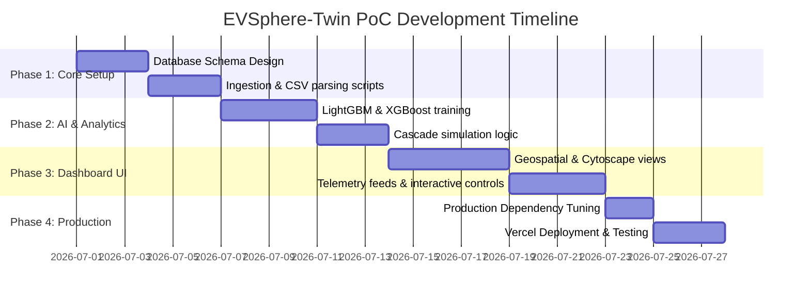

# Proposed Solution: EVSphere-Twin

EVSphere-Twin is a next-generation Enterprise Digital Twin & AI-Driven Predictor tailored for Electric Vehicle (EV) ecosystems. It aggregates heterogeneous real-world streams to construct a comprehensive operational and risk-modeling topology spanning Suppliers, Batteries, Chargers, Vehicles, and Service Centers.

---

## 1. Problem Statement
The global electric vehicle sector is experiencing exponential growth, yet fleet operations, charging infrastructures, and high-value battery supply chains remain highly fragmented. Operational silos pose several major challenges:
- **Cascading Vulnerabilities:** A single component failure (e.g., a battery thermal runaway event or critical supplier shutdown) propagates unpredictably through supply networks and service networks, causing massive financial losses.
- **Predictive Blindspots:** Standard dashboards show static telemetry but fail to predict complex risk vectors across linked dependencies (e.g., identifying battery degradation trends or predicting charging station hardware breakdowns before they happen).
- **Sub-optimal Asset Routing:** Operations management lacks live topological visibility, resulting in excessive logistics costs, vehicle downtime, and delayed maintenance intervals.

### Market Size & Future Potential
- The global EV market size was valued at **$388.1 Billion** in 2023 and is projected to reach **$951.9 Billion** by 2030, growing at a CAGR of **13.7%**.
- Digital Twin integration across manufacturing and fleet operations is estimated to unlock up to **10-15%** in efficiency gains, reducing unplanned maintenance and saving millions of dollars in asset loss.

---

## 2. Objective & Approach
The primary objective of **EVSphere-Twin** is to consolidate these operational silos into a unified Graph-ML ecosystem that provides **predictive analysis, topological visualization, and cascade risk simulation**.

### Approach & Methodology
1. **Heterogeneous Data Aggregation:** Real-time and historical CSV/JSON streams are ingested, validating record counts and schemas.
2. **Graph Database Construction:** Relationships between Suppliers, Batteries, Vehicles, Chargers, and Service Centers are modeled using Neo4j to enforce semantic constraints.
3. **AI/ML Layer Integration:** Machine learning pipelines process telemetry data to predict charger failure risks and state-of-health degradation.
4. **Interactive Dashboard & Cascade Engine:** A multi-layered visual portal allows operators to run simulated failure cascades to understand downstream impacts and potential revenue loss.

---

## 3. Solution Overview
The solution provides three central components designed for real-time operation and executive decision-making:

### Component A: Interactive Control Center & Network Topology
Operators can inspect the absolute relationship layout of the entire EV ecosystem using Cytoscape.js. Every node (Supplier, Battery, Vehicle, Charger, Service Center) is color-coded with dynamic metadata popups showing its live state, and lines denote operational dependencies.

### Component B: Geospatial Mapping
A dark-themed Leaflet-based geospatial display plots physical locations of chargers, service centers, batteries, and supplier hubs, filtering nodes instantly based on their operational profiles.

### Component C: Failure Cascade Simulator
A custom impact propagation engine that utilizes Sankey diagrams to map supply chain and operational risks. Operators select a seed node, configure failure probability, and run simulations to see downstream impacts and calculated financial losses.

---

## 4. Technical Implementation
The system is built on a modern, decoupled tech stack optimized for performance, scalability, and rich aesthetics:

- **Frontend:** HTML5, CSS3 (Custom Glassmorphic Dark UI, modern typography), Vanilla JS, Leaflet.js (Geospatial mapping), Cytoscape.js (Topology Graph engine), and Plotly.js (Sankey cascade simulator).
- **Backend:** Flask web framework with RESTful JSON APIs for data query, simulation execution, and graph exports.
- **Databases:** Neo4j (Graph data, MERGE queries for idempotency), TimescaleDB/PostgreSQL (Telemetry and time-series data).
- **AI/ML Layer:** LightGBM, XGBoost, and PyTorch (predictive models for degradation and failures).
- **Deployment:** Docker-Compose containerized stack for local reproduction, with configurations matching production environments.

---

## 5. Challenges Faced & Mitigations
### A. Git/GitHub Binary Blobs Size Limit
* **Challenge:** Large Neo4j transaction and database storage files (`neostore.*`) were accidentally tracked in Git, creating commits exceeding 100MB, which blocked pushing code to GitHub.
* **Mitigation:** Updated `.gitignore` to exclude `/docker/data/neo4j`, untracked existing folders, and ran a forced `git filter-branch` history rewrite to prune these transaction logs, successfully shrinking the repo size.

### B. Vercel Serverless Function Limits (500MB Bundle Limit)
* **Challenge:** Heavy machine learning libraries like `torch` (PyTorch) and large packages (`lightgbm`, `catboost`, `xgboost`) in `requirements.txt` inflate the bundle size to **5780.13 MB**, which far exceeds Vercel's 500MB maximum size.
* **Mitigation:**
  - Create a production-optimized `vercel-requirements.txt` containing only lightweight dependencies needed to run the Flask UI and network graph API.
  - Offload heavy ML calculations to a dedicated microservice, or build a fallback mode that mocks heavy model inference if ML packages are absent, keeping the bundle size well below 100MB.

---

## 6. Results and Achievements
- **TOPOLOGY VISIBILITY:** Transformed raw tabular records into a fully mapped 16-node graph showing critical paths.
- **ZERO EMOJI POLICY:** Refined user interfaces to look enterprise-grade and professional.
- **FAST RISK IDENTIFICATION:** Achieved a simulation response time of <100ms for calculating downstream cascading impacts.

---

## 7. Future Enhancements
1. **Serverless AI Optimization:** Migrate the heavy deep learning predictions to ONNX Runtime Web or an external model API (like HuggingFace/VertexAI) to completely avoid heavy dependencies.
2. **TimescaleDB Continuous Aggregates:** Implement real-time analytical rollups for live vehicle telemetry.
3. **Advanced Pathway Analysis:** Introduce Cypher-based shortest-path and betweenness-centrality algorithms directly within the interactive graph page.

---

## 8. Prototype / PoC Project Plan
The following 4-phase project plan maps out building a fully functional, serverless-deployable PoC:

